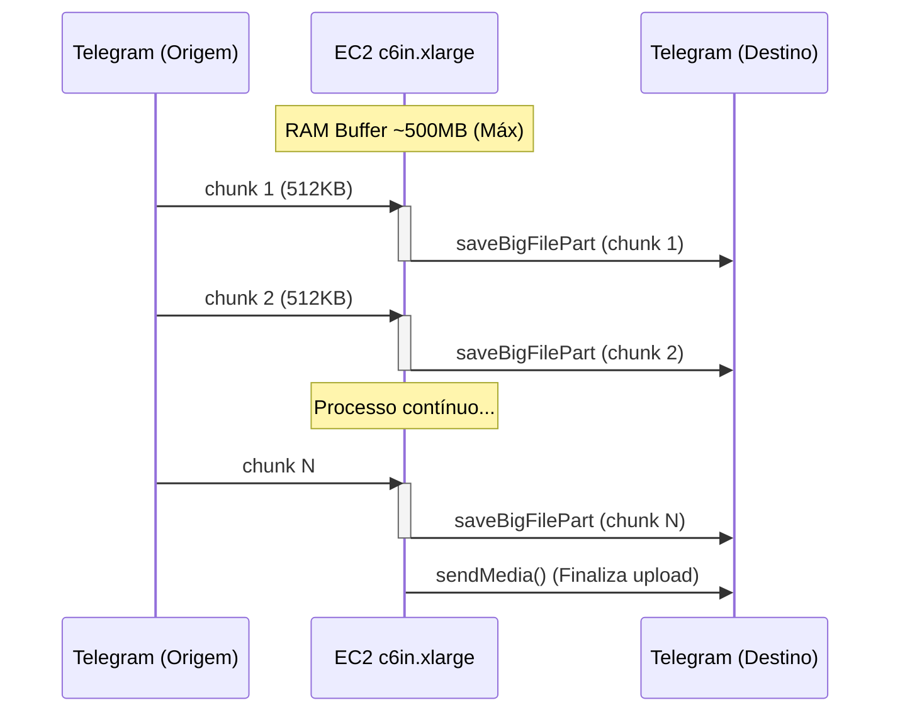

# PRD Final: Clone de Grupo Telegram (Streaming)

## 1. Visão Geral
Este projeto consiste em um clonador de grupos do Telegram de alta performance, utilizando uma arquitetura de streaming para processar arquivos grandes sem sobrecarregar a memória (RAM) ou o disco local. O sistema atua como um "pipe", baixando chunks da origem e enviando para o destino simultaneamente.

## 2. Arquitetura

### Pipeline de Streaming


**Principais Características:**
- **Zero Disk Usage**: Arquivos não são salvos em disco durante o streaming.
- **Low Memory Footprint**: Mantém apenas um buffer limitado (~500MB) em RAM via semáforos e controle de fluxo.
- **Parallel Uploads**: Realiza até 10 uploads de chunks em paralelo para maximizar a banda.

## 3. Especificações de Hardware

### Servidor Recomendado
- **Instância**: AWS EC2 `c6in.xlarge`
- **CPU**: 4 vCPU
- **RAM**: 8 GB
- **Rede**: 30 Gbps (Alta performance para streaming)
- **Armazenamento**: EBS gp3 50GB (Apenas para OS e logs/fallback)
- **OS**: Ubuntu 24.04 LTS

### Alocação de Recursos Estimada
| Componente | Uso de RAM |
|------------|------------|
| Buffer de Streaming | ~500 MB |
| Python + Telethon | ~200 MB |
| Sistema Operacional | ~300 MB |
| **Livre** | **~7 GB** |

### Custos Estimados
- **Computação (EC2)**: ~$140/mês
- **Storage (EBS)**: ~$4/mês
- **Data Transfer**: ~$10/mês
- **Total**: ~$154/mês

*(Alternativa Econômica: `c6in.large` por ~$84/mês)*

## 4. Implementação Técnica

### Stack Tecnológica
- **Linguagem**: Python 3.12+
- **Biblioteca Principal**: Telethon (MTProto API)
- **Criptografia**: `cryptg` (Aceleração de criptografia MTProto)

### Lógica de Streaming (`StreamingCloner`)
1. **Chunks**: 512KB (Limite MTProto)
2. **Buffer**: 20 Chunks (~10MB ativos)
3. **Paralelismo**: 10 Uploads simultâneos
4. **Rate Limit**: 3.5s entre mensagens (20 msgs/min)

### Algoritmo
O sistema utiliza `iter_download` para baixar chunks sequencialmente e despacha tarefas assíncronas `saveBigFilePart` para upload imediato. Um `asyncio.Semaphore` controla a concorrência de uploads para não estourar a memória.

## 5. Performance Comparativa (Arquivo 2GB)

| Método | Tempo | RAM Max | Disco Usado |
|--------|-------|---------|-------------|
| Download -> Upload | ~7 min | 2+ GB | 2 GB |
| Download -> Disco -> Upload | ~6 min | ~100 MB | 2 GB |
| **Streaming Real** | **~4 min** | **~500 MB** | **0 GB** |

## 6. Configuração do Sistema (Sysctl Tuning)
Para suportar o throughput de 30Gbps, o kernel deve ser tunado:
- TCP Buffer Window aumentado (rmem/wmem)
- Congestion Control: BBR
- Queueing Discipline: FQ
- File Descriptors: 1M+

## 7. Variáveis de Ambiente
```bash
TG_API_ID="123456"
TG_API_HASH="abcdef..."
SOURCE_CHAT="-100..."
TARGET_CHAT="-100..."
SOURCE_TOPIC="123" (Opcional)
TARGET_TOPIC="456" (Opcional)
```
